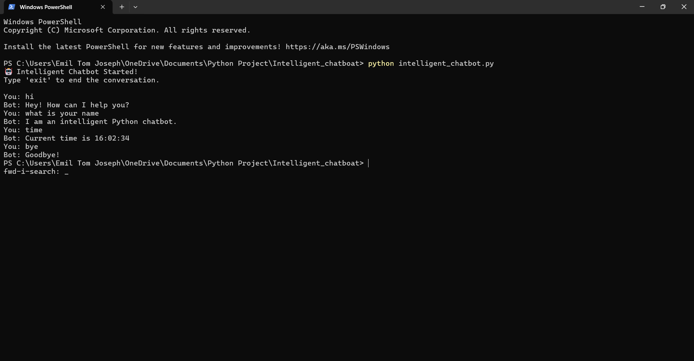

# Intelligent Python Chatbot

An intelligent rule-based chatbot built using Python that interacts with users through text-based conversation.  
The chatbot uses simple Natural Language Processing techniques to detect user intent and sentiment and respond accordingly.

This project demonstrates fundamental concepts of **chatbot development, NLP preprocessing, and sentiment analysis**.

---

## Features

- Text-based conversational chatbot
- Intent detection using keyword matching
- Basic sentiment analysis (positive / negative / neutral)
- Dynamic responses using random selection
- Displays current **time and date**
- Saves conversation history to a file
- Simple command to exit the chatbot

---

## Technologies Used

- Python
- Natural Language Processing (basic)
- Regular Expressions (`re`)
- Random response selection
- Datetime module
- File handling

---

## Project Structure
```
│
├── intelligent_chatbot.py
├── chat_history.txt
├── screenshots
│ └── chatbot.png
└── README.md
```

---

## How It Works

The chatbot processes user input using several steps:

1. **Text preprocessing**
   - Converts input to lowercase
   - Removes special characters

2. **Intent detection**
   - Matches user input with predefined keywords

3. **Sentiment analysis**
   - Determines positive, negative, or neutral tone

4. **Response generation**
   - Chooses a response from predefined response lists

5. **Chat logging**
   - Saves conversation history to a text file

---

## Screenshots




---

## Future Improvements

- Implement machine learning based chatbot
- Add GUI interface
- Integrate speech recognition
- Use advanced NLP libraries like **NLTK or spaCy**
- Connect to AI APIs like **OpenAI or HuggingFace**

---

## Author

**Emil Tom Joseph**

B.Tech Computer Science & Engineering (Cyber Security)  
Amal Jyothi College of Engineering  
Academic Year: 2025–2026

---

## License

This project is developed for educational purposes.
